# CommerceCart

Commercecart is an fullstack shopping app, which has two user compatitlity i.e user and admin. It is built using flutter and node.js.
Here is the commercecart backend :

## Admin Structure

<table>
<tr>
 <td>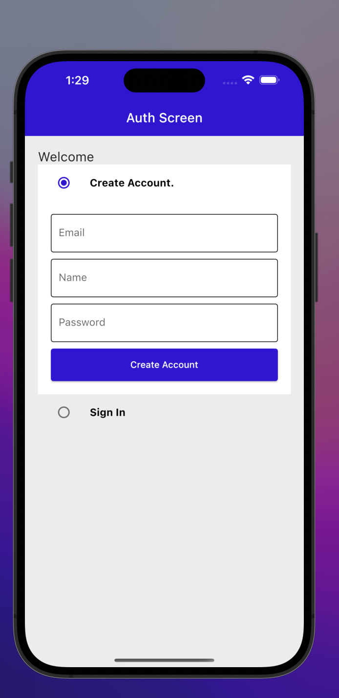</td>   
  <td>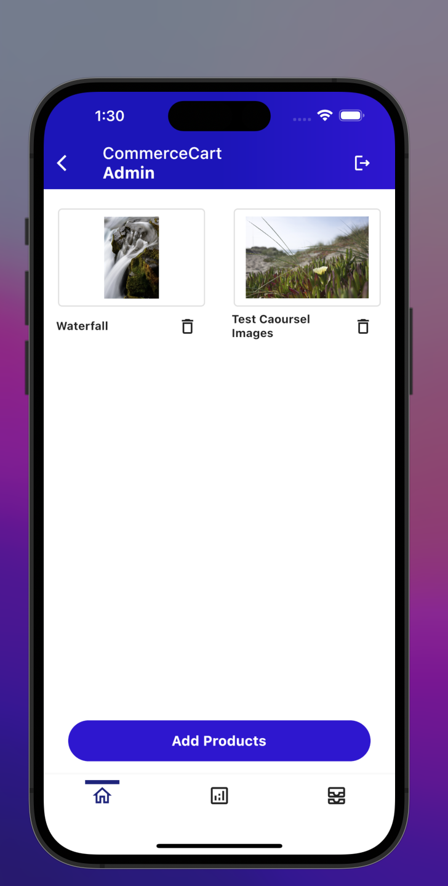</td>   
  <td>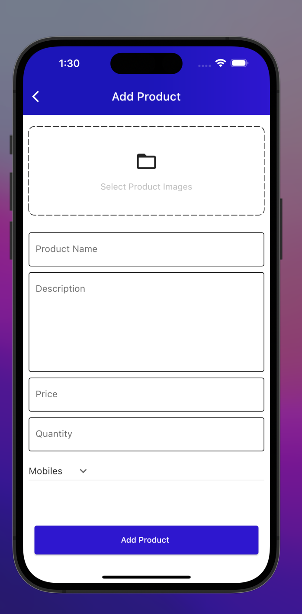</td>   
</tr>
</table>
<table>
<tr>
 <td>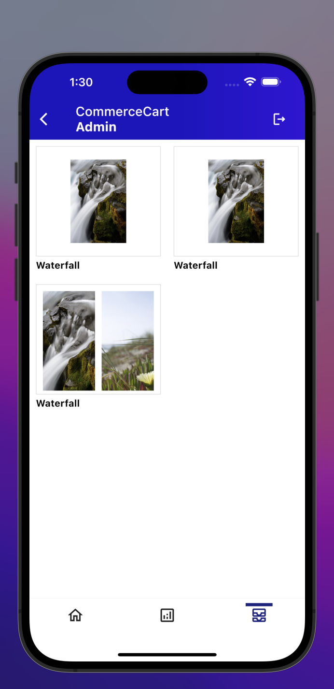</td>   
  <td>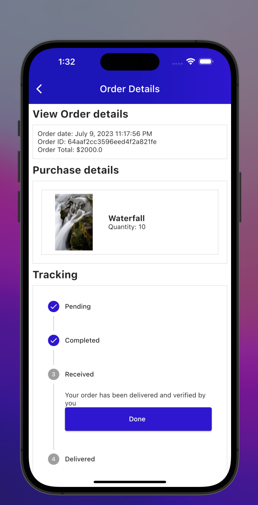</td>   
  <td>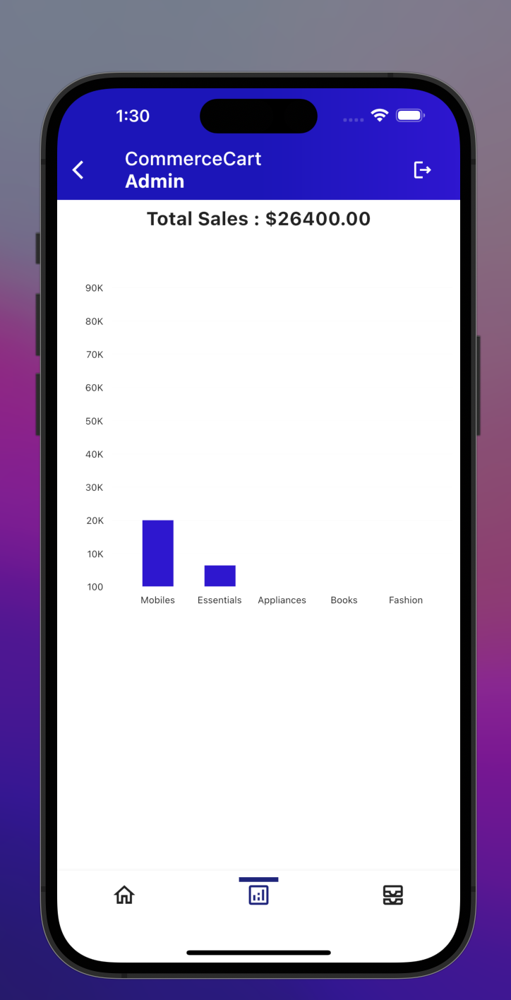</td>   
</tr>
</table>

## User Structure

<table>
<tr>
 <td>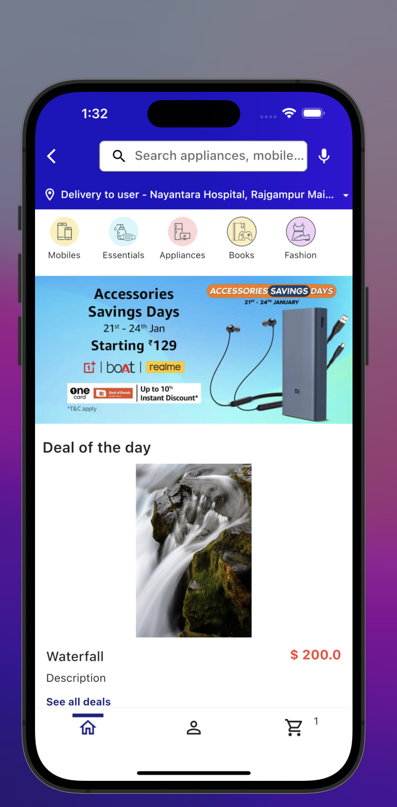</td>   
  <td></td>   
  <td>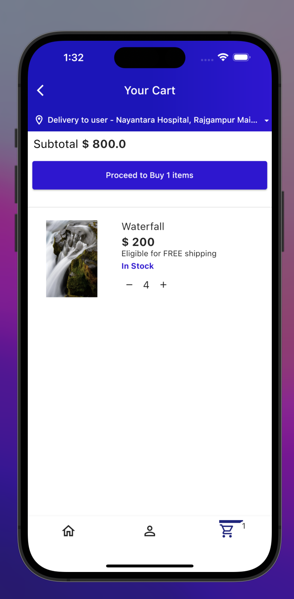</td>   
</tr>
</table>
<table>
<tr>
  <td></td>   
  <td>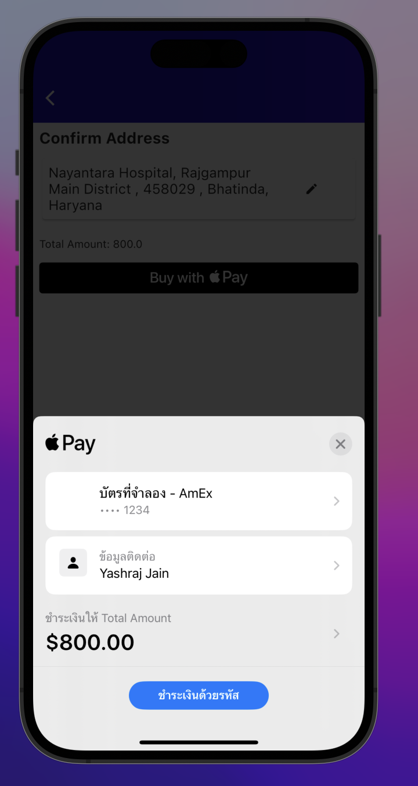</td>   
  <td>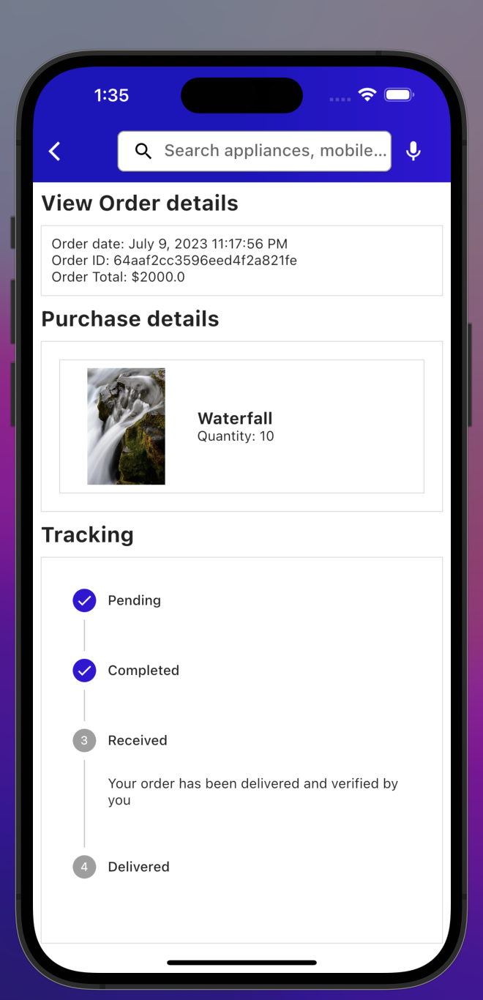</td>  
</tr>
</table>
<table>
<tr>
   <td>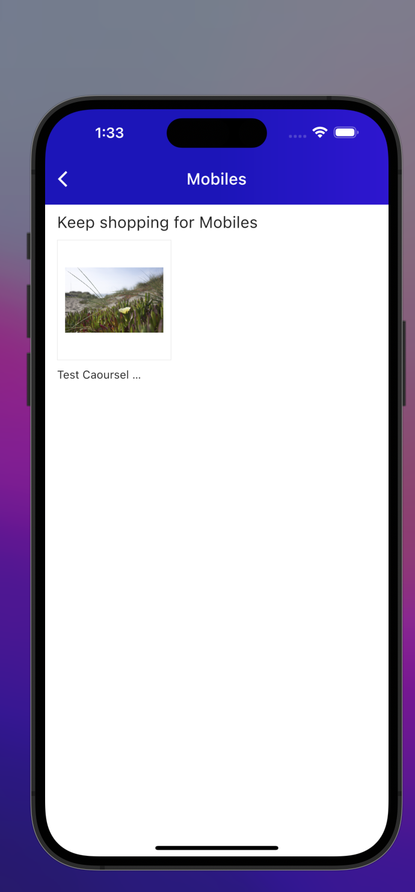</td>
 <td>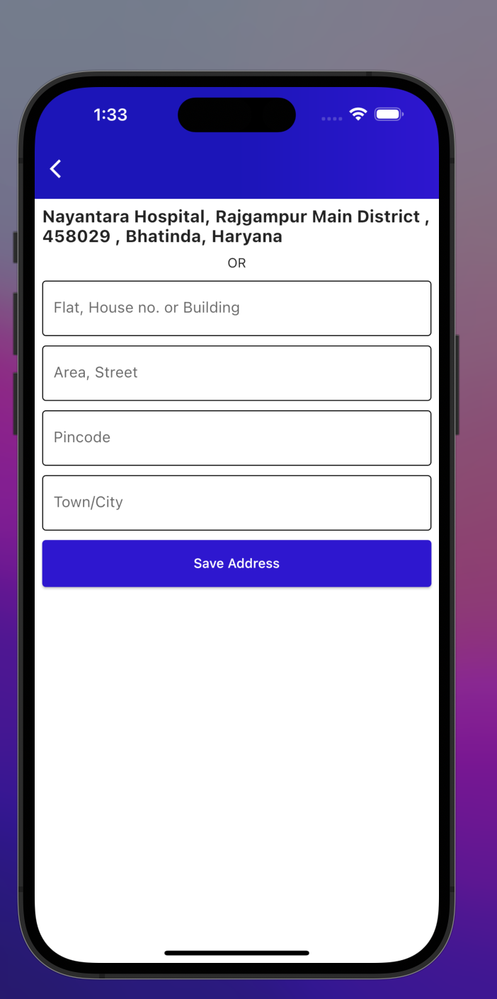</td>
</tr>

</table>
